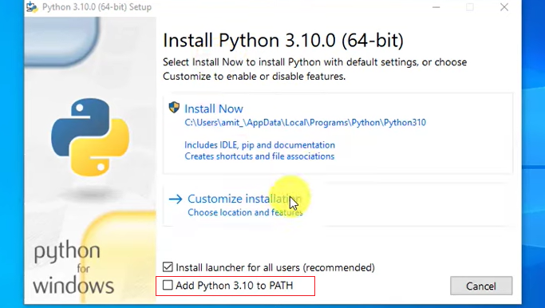
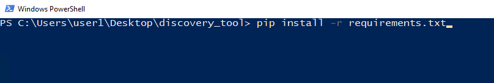
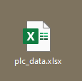

# PLC Discovery and Audit Tool

The PLC Discovery and Audit tool is a python based script, utilizing the [pylogix](https://github.com/dmroeder/pylogix) library, as a communication driver to discover Rockwell devices on the network and perform an audit of the rack. 

-----

## Capabilities

The discovery and audit script can be run to discover rockwell devices on the network. The script will than use the discovered devices IP and audit the racks to provided detailed information about said devices. 

-----

## Usage

### Pre-requisites

1. This tool requies Python 3 to be installed. The download can be found [here](https://www.python.org/downloads/). 
    
    1.1. During installation, please Add Python 3.xx to PATH. See the image below. 



2. Install Module Requirements. 
    
    2.1. This can be done by right 'shift' + 'Right Click' in file explorer to lauch Powershell.

```console
    pip install -r requirements.txt
```

    
### Running
To run the program and start the tool complete one of the following. 
    
1. From the file explorer "shift" + "right click" and select <i> Open with PowerShell here.</i>
    
2. Double click the python file - This requires the install now option to be selected while installing, and python being added to PATH. 

The script will run without user inpur required.

### Output
Once the script has run, the output of the script will be saved into a respective excel sheets and saved to the hosts desktop. 

<div style="text-align: center;">



</div>

-----

## Limitations
This tool only work with the following:

<i>Only PLC's that are programmed with RSLogix5000/Studio5000 or Connected Components Workbench (Micro8xx), models like PLC5, SLC, MicroLogix are <b>not</b> supported.</i>

This is a limitation in the pylogix library. Please see [here](https://github.com/dmroeder/pylogix) for more information
