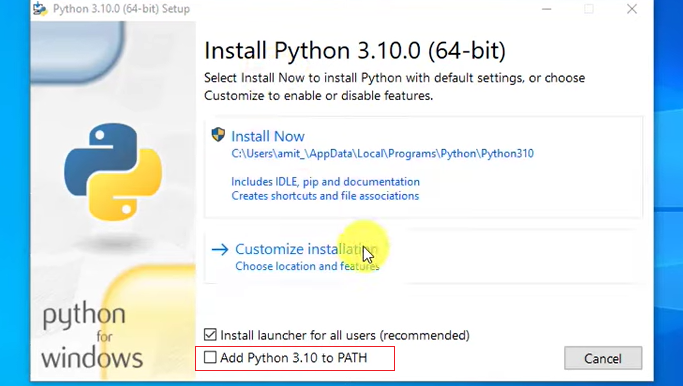
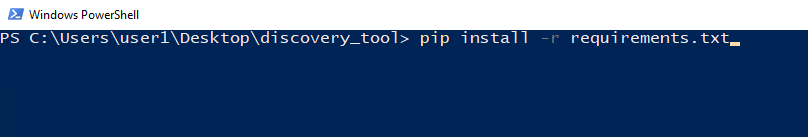
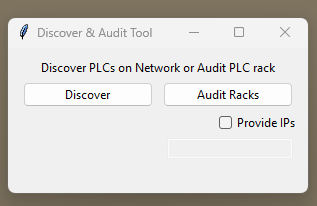
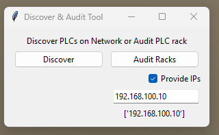
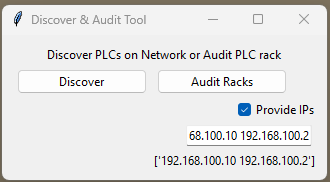
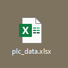

# PLC Discovery and Audit Tool

The PLC Discovery and Audit tool is a python based tool, utilizing the [pylogix](https://github.com/dmroeder/pylogix) library, as a communication driver to discover Rockwell devices on the network and perform an audit of the rack. 

-----

## Capabilities

The discovery and audit tool has two main functions.
-Discovery 
-Audit
They can be used independently or together. The output from either of the operators will be saved to an excel file.

-----

## Usage

### Pre-requisites

1. This tool requies Python 3 to be installed. The download can be found [here](https://www.python.org/downloads/). 
    
    1.1. During installation, please Add Python 3.xx to PATH. See the image below. 



2. Install Module Requirements. 
    
    2.1. This can be done by right 'shift' + 'Right Click' in file explorer to lauch Powershell.

```console
    pip install -r requirements.txt
```

    
### Running
To run the program and start the tool complete one of the following. 
    
1. From the file explorer "shift" + "right click" and select <i> Open with PowerShell here.</i>
    
2. Double click the python file - This requires the install now option to be selected while installing, and python being added to PATH. 

The GUI will lauch. The user can select either the discover or audit options.

<div style="text-align: center;">



</div>

If the audit fuction is used without the discover option being used first. The user must provide an IP address to audit. Multiple IP Address can be provided. The GUI will display the IP addresses that have been accepted. 

<div style="text-align: center;">




</div>

### Output
Once the discover tool or audit tool has be run and the application closed. The output of the tool will be saved into a respective excel sheet and saved to the hosts desktop. 

<div style="text-align: center;">



</div>

-----
## Limitations
This tool only work with the following:

<i>Only PLC's that are programmed with RSLogix5000/Studio5000 or Connected Components Workbench (Micro8xx), models like PLC5, SLC, MicroLogix are <b>not</b> supported.</i>

This is a limitation in the pylogix library. Please see [here](https://github.com/dmroeder/pylogix) for more information

-----
## Improvements

* Update the output file to include date and time in file name
* Update GUI file to include notifcaiton on succesful execution of discover and audit tool
* Add ability to grab tags during audit. This may be better implemented as a seperate tool. 